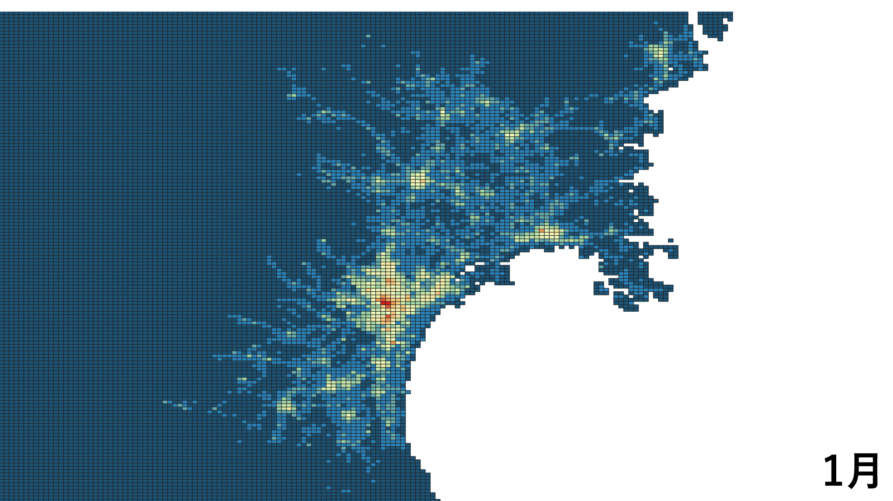

# 宮城県と仙台市における人流データの分析

## 概要

この分析は宮城県と仙台市における人流データに分析である。両方に分け、宮城県における人流データの可視化と仙台市における人流データの分析である。さらに、仙台市の人流データ分析は、日付（曜日）・天気・場所によって分け、分析した。それぞれの科目に相当するフォルダを選択し、分析結果をご覧できる。

## 分析結果

[人流と日付・曜日の関係(日編)](./day_analysis/day_analysis.md)

[人流の１か月分](./day_analysis/month_analysis.md) 

[人流と場所の関係](./place_analysis/place_analysis.md)  

[人流と気象条件の相関](./weather_analysis/weather_analysis.md)

[過去３年間(2019~2021)の仙台市における人流](./Sendai_analysis/Sendai_analysis.md)

## 宮城県における人流データの可視化の例

「全国の人流オープンデータ」(国土交通省) (https://www.geospatial.jp/ckan/dataset/mlit-1km-fromto) を加工して作成

## 仙台市における人流データの分析

データを集めた場所一覧

|場所コード|場所名|
|:--------|:-----|
p003|東五番丁通：ドン・キホーテ|
p004|東五番丁通：山一仙台中央ビル|
p005|東五番丁通：須田ビル|
p008|unknown|
p010|東四番丁通：末広庵総本店（そば）|
p011|クリスロード：ソフトバンク仙台クリスロード|
p012|unknown|
p013|東三番丁通：桜井薬局|
p014|東二番丁通：阿部蒲鉾店|
p015|unknown|
p017|東二番丁通：電力ビル|
p020|南光院丁：藤崎仙台ビルディング|
p021|いこゐ小路：土屋ミシン|
p023|サンモール一番町：kurax|
p024|unknown|
p025|サンモール一番町：YAMAHA|
p026|サンモール一番町：金港堂|
p027|青葉通：青葉通一番町パーキング|
p028|青葉通：キンコーズ|
p029|青葉通：まちくる仙台|
p030|ベガルタ仙台試合会場|

## 謝辞

このデータは東北大学データ駆動科学・AI教育研究センターと国土交通省からご提供してくださったものであり、この研究の作者は東北大学の研究所と国土交通省にお礼を申し上げます。

## 出典

「全国の人流オープンデータ」(国土交通省) (https://www.geospatial.jp/ckan/dataset/mlit-1km-fromto)
