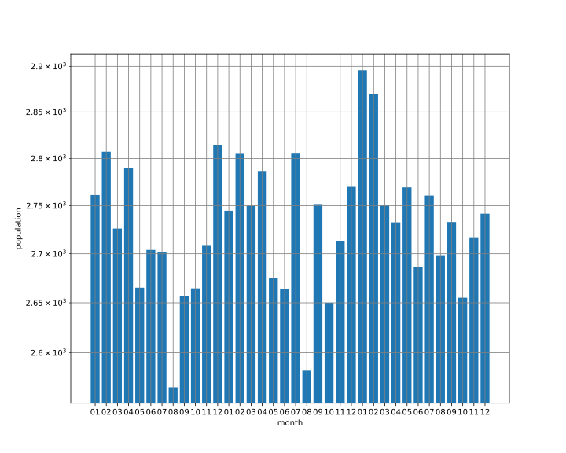
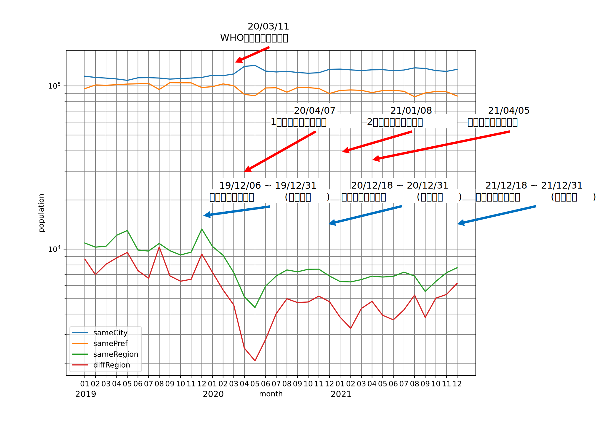
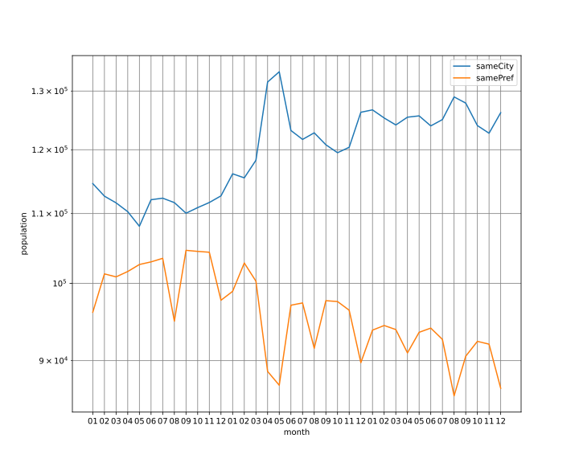

# 3年間の仙台市の人流データの分析

## 概要
2019年～2021年の仙台市の人流データを分析したものである。1か月ごとの仙台市に滞在した人数と、人の流入量をグラフにした。

## データソース
国土交通省が公開している全国の人流オープンデータ(https://www.geospatial.jp/ckan/dataset/mlit-1km-fromto )を加工して使用。

## 使用データの詳細
仙台市の平日昼間のデータを使用。また、人の流入量は仙台市内、市外の宮城県内、東北地方の県外、他地方の県外の4区分である。どちらのデータも平均を使用している。

## 仙台市内の滞在人数のグラフ

  

## 仙台市への人の流入量のグラフ
### 全区分比較

  

### 県内のみの比較

  

### データから見えること
- 仙台市8月で減る→夏休みで県外に旅行。お盆で帰省。宮城には来るが松島や三陸など仙台市外の観光地に行く。
- 2020年4月16日～5月14日まで緊急事態宣言。急激に人の流れ減ってる。他県から来る人が特に。
- 一方、2020年4月以降仙台市内からの人の流れは2019年と比較すると増えている。コロナ禍で近場に出かけるようになったから。
- 毎年2月は多い
- 8月、12月に他県からの人が増える->お盆、年末に帰省するから
- 2019年は12月人多いが、2020年、2021年はそんなに。ひかぺの規模縮小が影響...?
