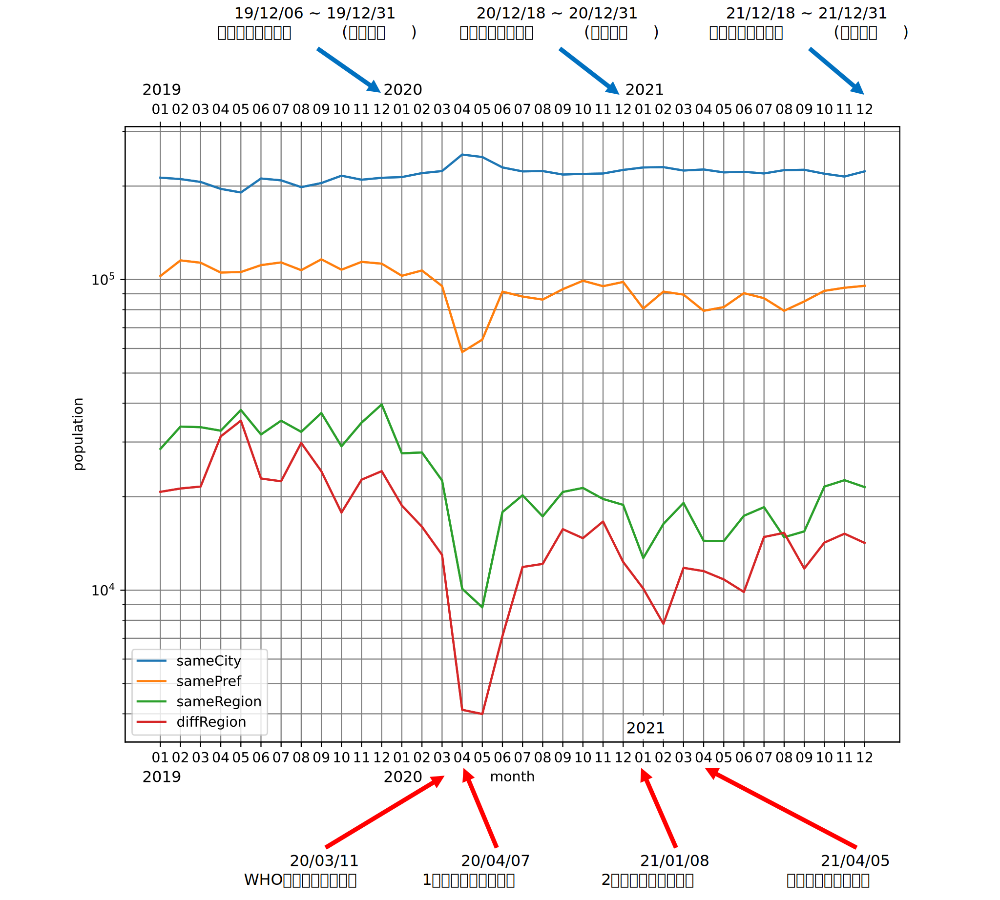

# 3年間の仙台市の人流データの分析

## 概要
2019年～2021年の仙台市の人流データを分析したものである。1か月ごとの仙台市に滞在した人数と、人の流入量をグラフにした。

## データソース
国土交通省が公開している全国の人流オープンデータ(https://www.geospatial.jp/ckan/dataset/mlit-1km-fromto )を加工して使用。

## 使用データの詳細
仙台市の平日昼間のデータを使用。また、人の流入量は仙台市内、市外の宮城県内、東北地方の県外、他地方の県外の4区分である。どちらのデータも平均を使用している。

## 仙台市内の滞在人数のグラフ

  

## 仙台市への人の流入量のグラフ
### 全区分比較

  

### 県内のみの比較

  

## 分析結果
#### 新型コロナウイルスの流行の影響が大きい
全区分での人の流入量のグラフを見ると、2020年3月を境に急激に減少し、5月が最も少なくなっていることが分かる。2020年3月はWHOが新型コロナウイルスをパンデミックに認定し、日本国内でもコロナ感染者が増加し始めた時期である。また、2020年4月16日～5月14日は宮城県にも緊急事態宣言が発令されていた。新型コロナウイルスの流行により宮城県を訪れる人が減少したと言える。 
2020年5月以降は増加しつつあるが、コロナ禍以前の人数には届いていない。緊急事態宣言解除後も感染しないような行動をとる人が多かったためである。
 
そして、県内のみの流入量のグラフを見ると2020年3月から市内からの流入量は増え、市外からは減っている。これは、感染防止のために外出を自粛し、家や近所で過ごす時間が増えたからだと考えられる。

#### 8月は毎年減少する
2019年8月の滞在人数の少なさが顕著である。県外から訪れる人は増加しているが、県内からの人は減少している。お盆で帰省するがいること、松島や三陸の海など仙台市外の観光地に行く人が多いことが原因として挙げられる。

#### 12月は毎年増加する
滞在人数も流入人数も12月は毎年増加している。12月に開催されている光のページェントを目的に訪れる人が多いからだと考えられる。一方、2020年、2021年は2019年ほど滞在人数が多くない。コロナ禍により規模を縮小して開催されたことが影響しているのではないだろうか。年末ということで仙台に帰省する人が多いことも理由の一つである。

#### 3年間の中で2021年1月の滞在人数が最も多い
2021年はコロナ禍だったにも関わらず滞在人数が最も多くなっている。仙台の1月と言えば、初売りだ。この初売りが滞在人数の多さに関係していると考える。2021年の仙台初売りは事前予約制で行われた。事前に買えることが分かっているため来る人も増えたと考えられる。
