# 日付によって人流データの分析した結果

日付と曜日の関係を求めて、以下のように分析することができる。

## 概要
この分析は、曜日（複数週）と人数（Bluetoothデバイスに反映する）の関係を時間帯に分析することと、一週間分の曜日と人数の関係を時間帯に分析することである。

## データソース
東北大学データ駆動科学・AI教育研究センターから提供されたBLE信号センサによる滞留人数のデータ

---

## 曜日（複数週）と人数（Bluetoothデバイスに反映する）の関係を時間帯に分析する

### 企業
以下の図は、一つの例として、山一仙台中央ビルにおけるそれぞれの曜日のBluetoothデバイスと時間である。

**月曜日**

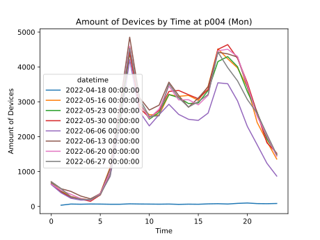</img>

**火曜日**

</img>

**水曜日**

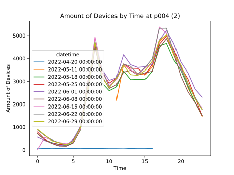</img>

**木曜日**

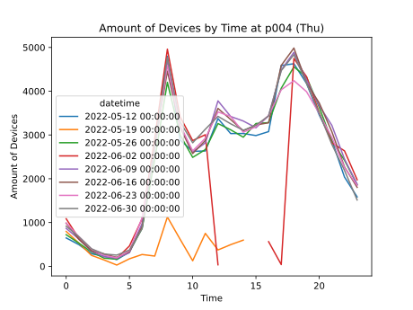</img>

**金曜日**

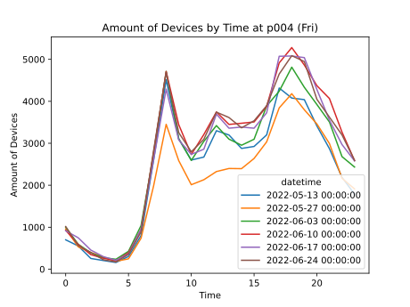</img>

**土曜日**

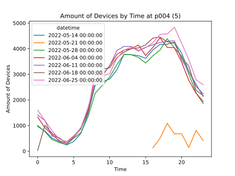</img>

**日曜日**

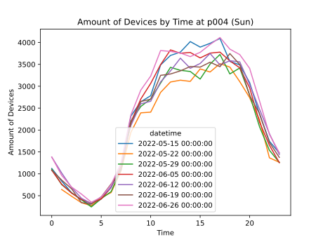</img>

### 解説
以上の図からみると、平日（月・火・水・木・金）のグラフの頂点が2つあり、その時間帯は朝の7：00から8：00の時間帯と、夜の17：00から18：00の時間帯である。この理由は、登下校や通勤の時間からである。逆に、週末（土・日）のグラフは朝から徐々に増える傾向がみられ、14：00頃には、人が多いことがわかる。その後、人が少なくなり、20：00以降には人があまりいないということがわかる。

### 商店街
以下の図は、一つの例として、ソフトバンク仙台クリスロードにおけるそれぞれの曜日のBluetoothデバイスと時間である。

**月曜日**

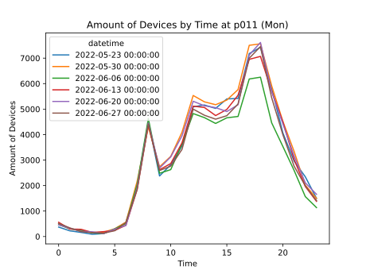</img>

**火曜日**

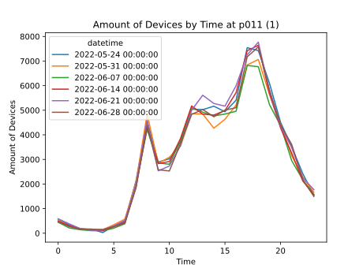</img>

**水曜日**

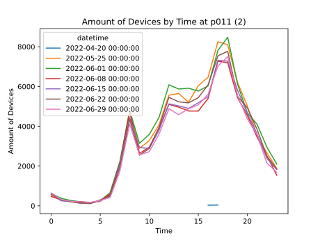</img>

**木曜日**

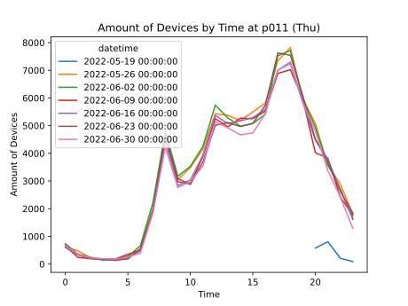</img>

**金曜日**

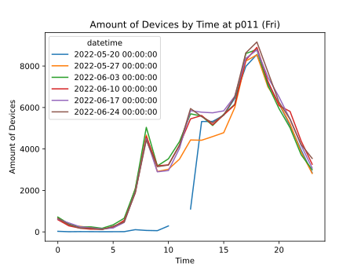</img>

**土曜日**

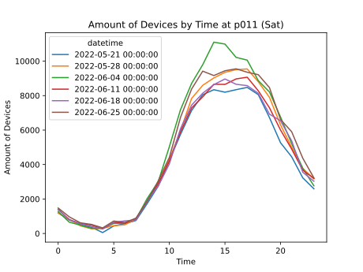</img>

**日曜日**

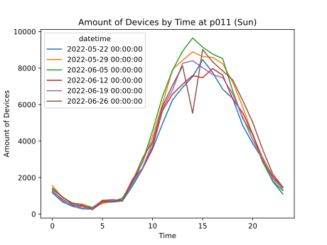</img>

### 解説
以上の図からみると、平日は、午前中の8：00に人数がピークになった。その後、人数が減ることがわかり、13：00以降になると、再び人数が増えることがわかる。その理由は昼休憩や通勤・授業の後からである。逆に、週末（土・日）のグラフは朝から徐々に増える傾向がみられ、14：00頃には、人が多いことがわかる。その後、人が少なくなり、20：00以降には人があまりいないということがわかる。商店街の週末の傾向は企業とほぼ同じである。

### 実際の適用
以上の分析により、平日のパターンと休日（週末）のパターンが異なることを示している。それぞれのパターンにより、貴社（企業・商店街）が適切な時間帯と場所に、広告の実施や在庫の数量の増加などをし、自分の売り上げを上げることができる。

---

## 一週間分の曜日と人数の関係を時間帯に分析する

**1週目**

  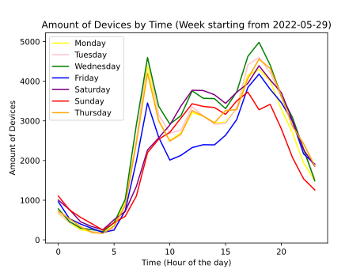</img>

  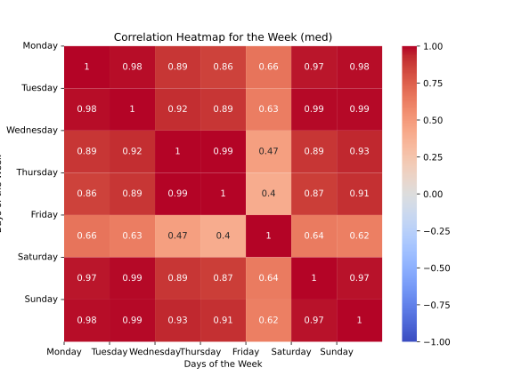</img>

**2週目**

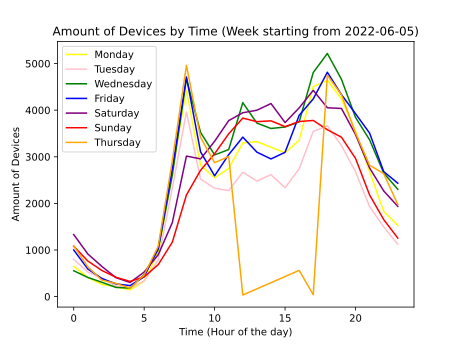</img>

  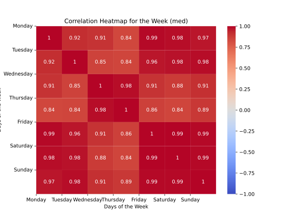</img>

**3週目**

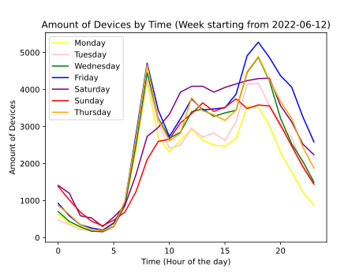</img>

  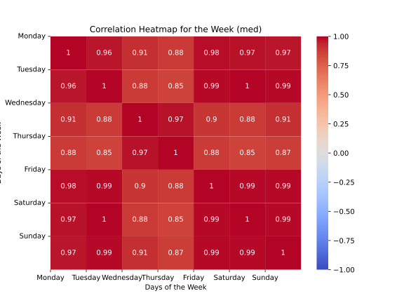</img>

**4週目**

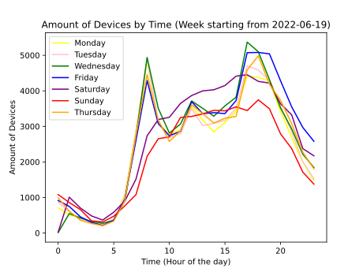</img>

  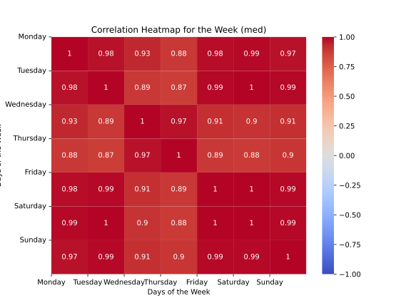</img>

