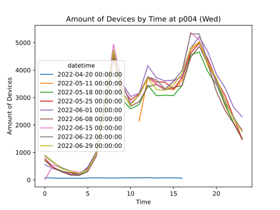

# 日付によって人流データの分析した結果

日付と曜日の関係を求めて、以下のように分析することができる。

## 一つの場所における曜日の変化
以下の図は、山一仙台中央ビルにいけるそれぞれの曜日のBluetoothデバイスと時間である。

### 月曜日

</img>

### 火曜日

</img>

### 水曜日

</img>

### 木曜日

</img>

### 金曜日

</img>

### 土曜日

</img>

### 日曜日

</img>

