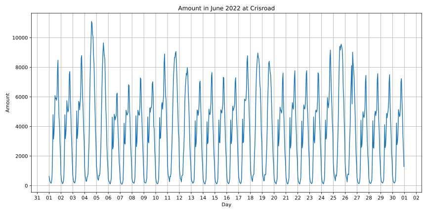

# 1か月分の人流データの変化
それぞれの場所（企業・商店街）における1か月分の人流データの変化を分析する。

## 概要
この分析は、ある期間内（１か月分）における人流の変化を分析する。

## データソース
東北大学データ駆動科学・AI教育研究センターから提供されたBLE信号センサによる滞留人数のデータ

## 商店街
### ドン・キホーテ
商店街の例として、
<a href="https://www.google.com/maps/place/Don+Quijote+Sendaieki+Nishiguchi+Honten/@38.2615751,140.8791388,20z/data=!3m1!5s0x5f8a282286e21f93:0x1e78f86f1a14dc99!4m6!3m5!1s0x5f8a29ebf3326a1f:0xfd9290a3259806c8!8m2!3d38.2616387!4d140.8792368!16s%2Fg%2F1tdd0hgt?entry=ttu">ドン・キホーテ 仙台駅西口本店 </a>
(38.261525935778536, 140.87919292423575) 
を選んだ。

**5月**

  

**6月**

  

**データの期間内**

  

**解説**

### ソフトバンク仙台クリスロード
商店街の例として、
<a href="https://www.google.com/maps/place/Softbank+Sendai+Clis+Road/@38.2616897,140.8771525,21z/data=!3m1!5s0x5f8a282319375d9d:0x7ed4017139cece0!4m6!3m5!1s0x5f8a28231922ce7d:0x54042ff31446ee43!8m2!3d38.2617006!4d140.8773583!16s%2Fg%2F1tjl5qrn?entry=ttu">ソフトバンク仙台クリスロード </a>
(38.26169217582066, 140.8773717110438) 
を選んだ。

**5月**

  

**6月**

  

**データの期間内**

  

**解説**

## 企業
### 電力ビル
企業の例として、
<a href="https://www.google.com/maps/place/FamilyMart+Electricity+Building/@38.2618213,140.8737448,20z/data=!3m1!5s0x5f8a283ca46b69bb:0xbaf3fd18be527d1c!4m6!3m5!1s0x5f8a283b58ddaa5d:0xe57a2d2dfd3d4a78!8m2!3d38.261659!4d140.8737284!16s%2Fg%2F1tpn2ctw?entry=ttu">電力ビル</a>
(38.261723663589734, 140.8737769152344) 
を選んだ。

**4月**

  

**5月**

  

**6月**

  

**データの期間内**

  

**解説**

### 土屋ミシン工業
企業の例として、
<a href="https://www.google.com/maps/place/38%C2%B015'39.6%22N+140%C2%B052'22.9%22E/@38.2610042,140.8704475,17z/data=!3m1!4b1!4m4!3m3!8m2!3d38.261!4d140.8730278?entry=ttu">土屋ミシン工業 </a>
(38.261010148734044, 140.8730133059194) 
を選んだ。

**4月**

  

**5月**

  

**6月**

  

**7月**

  

**8月**

  

**データの期間内**

  

