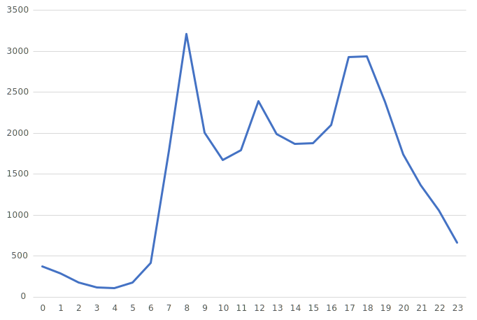
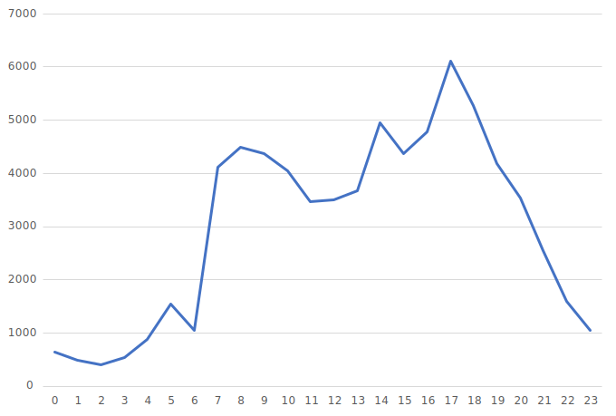
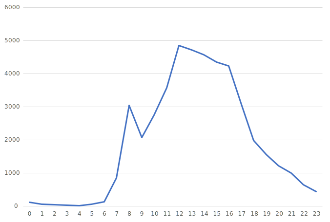
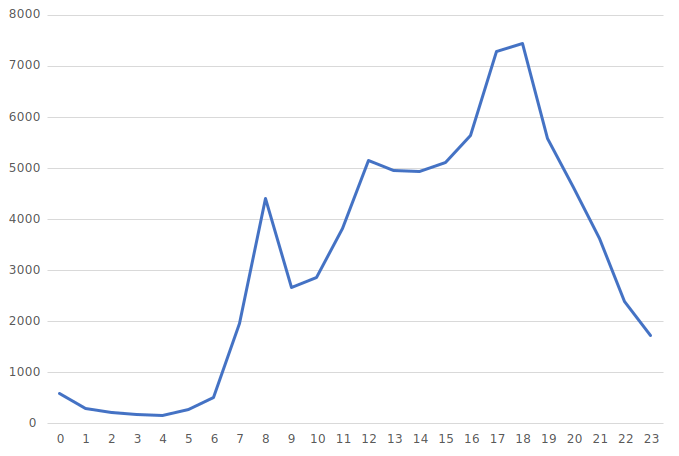

# 人流と場所の関係
## 概要
この分析は、人流と場所の関わりを分析したものである。キンコーズ、阿部蒲鉾店、末広庵、ソフトバンク仙台クリスロード店の4地点を分析の対象とした。

## データソース
東北大学データ駆動科学・AI教育研究センターから提供されたBLE信号センサによる滞留人数のデータ

## 観測地点
対象地点は、以下の画像の場所に位置している。

## 1日の人数の変化
1日の人数の変化をグラフで表示する。2022年6月の水曜日の平均をとったデータを使用している。
### 1. キンコーズ

  

### 2. 阿部蒲鉾店

  

### 3. 末広庵

  

### 4. ソフトバンク仙台クリスロード店

  

