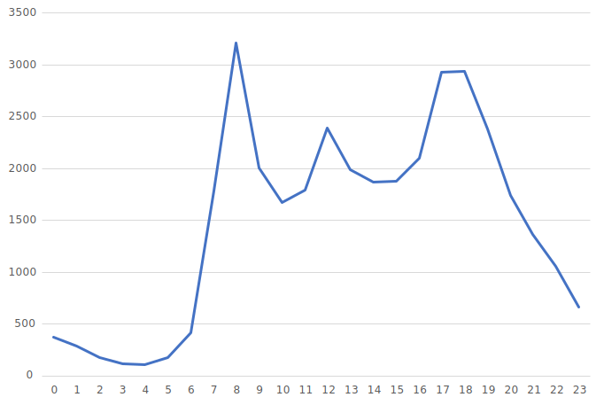
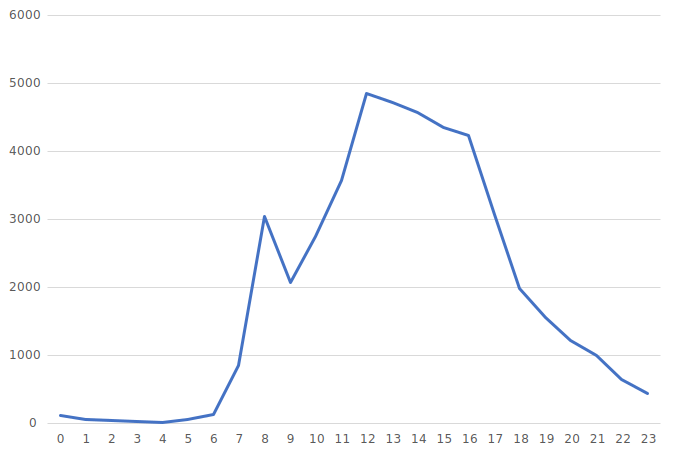

# 人流と場所の関係
## 概要
この分析は、人流と場所の関わりを分析したものである。キンコーズ、阿部蒲鉾店、末広庵、ソフトバンク仙台クリスロード店の4地点を分析の対象とした。

## データソース
東北大学データ駆動科学・AI教育研究センターから提供されたBLE信号センサによる滞留人数のデータ

## 観測地点
対象地点は、以下の画像の場所に位置している。

## 1日の人数の変化
1日の人数の変化をグラフで表示する。2022年6月の水曜日の平均をとったデータを使用している。
### 1. キンコーズ

  

8時と17時、18時がピークとなっている。

### 2. 阿部蒲鉾店

  

17時が最も多くなっている。

### 3. 末広庵

  

12時が最も多くなっている。

### 4. ソフトバンク仙台クリスロード店

  

17時、18時が山となっている。

## 分析結果
1、2、4は7時-8時、17時-18時の2つの山があるグラフである。この3地点は近くに駅があり、通勤通学する人が多いからだと考えられる。一方、3は12時が山である。地図を見ると3も駅が近いように思えるが、3は通りから少し入ったところに位置している飲食店である。よって、12時が最も多くなったと考えられる。 
この結果は以下のように生かすことができると考えている。 
- 17時、18時の時間帯に通勤通学者が買いやすい商品をメインに販売する
- 7時、8時は人通りが増えるため時間を少しずらして外出する 

また、今回は4地点のみ分析したが分析地点を変えることで、その店の最も客が多い時間やアーケードの人通りの多い時間も知ることができる。
