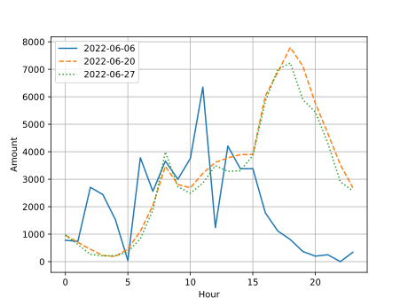
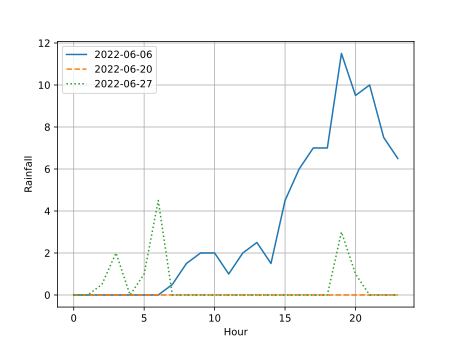
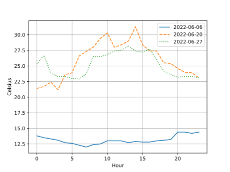

# 人流と気象条件の相関

## 概要

この分析は，ドン・キホーテ仙台駅西口本店前(緯度: 38.261525935778536、経度: 140.87919292423575)  
における2022年6/9(月),20(月),27(月)の人流量と気象情報の相関関係を調査したものである。

## データソース

人流データ：東北大学データ駆動科学・AI教育研究センターから提供されたBLE信号センサによる滞留人数のデータ  
気象情報：[気象庁](https://www.jma.go.jp/jma/index.html)が公開している宮城県仙台市の一時間ごとの気象データ

## 気象庁の昼夜の定義

昼=06:00~18:00  
夜=18:00~翌06:00

## 比較する日付の仙台市の天気  

- 6/6：  
昼:大雨  
夜:大雨  
日照時間:0.0時間  
- 6/20：  
昼:晴  
夜:晴  
日照時間:12.9時間  
- 6/27：  
昼:雷を伴う雲一時雨  
夜:雲一時雨  
日照時間:1.2時間

---

以下はグラフおよびヒートマップで表された結果である。

### 時間と人流量のグラフ  

### 時間と降水量のグラフ  

### 時間と気温(℃)のグラフ  

### 相関係数を表すヒートマップ  

グラフからは，6/6の15時に人流量が急激に現象していることがわかる。この時間帯は降水量が急増している時間でもあり，降水量と人流量の関連性が見られる。  
降水量(`rainfall`)と人流の量を示す(`amount`)の間には-0.35程度の弱い相関が見られた。気温(`celsius`)と人流量の間にも0.31程度の弱い相関が見られ，人流量と気象条件には一定の相関がある可能性がある。

しかしこの相関係数は３日分のデータでのみ算出したため，正確ではない。正確性を上げるために，より長い期間，広い地域に渡ったデータを集めたり，降水量と気温の他に存在している湿度，発雷，気圧などの気象条件についても考えて，相関を求めることが次の課題になるだろう。